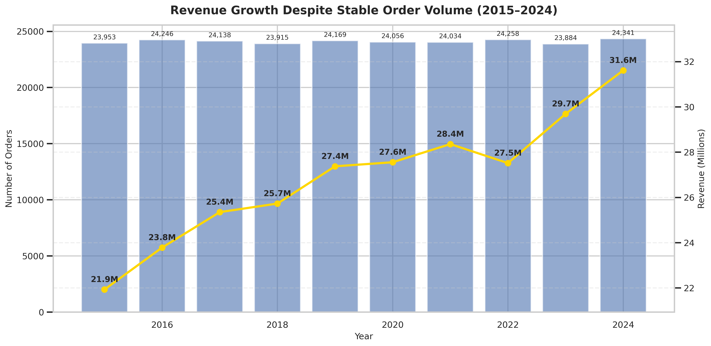
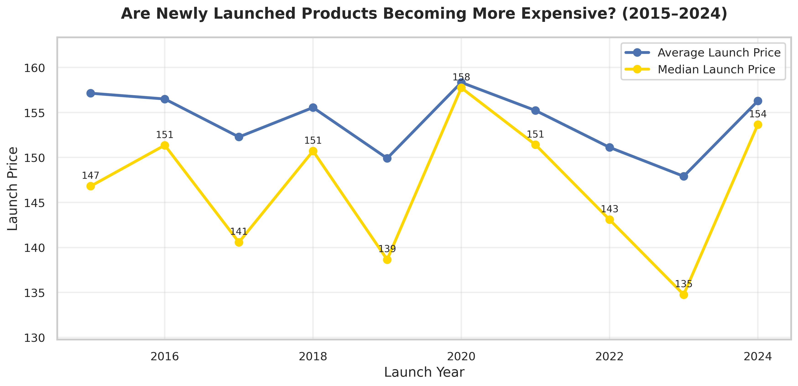
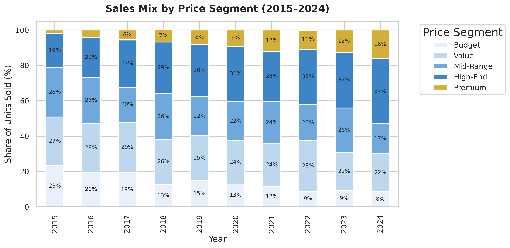

# Revenue Growth Drivers & Inventory Optimization in Fashion Retail (2015–2024)

## Project Overview

Revenue growth is usually associated with selling more products. While exploring this dataset, I noticed that the business followed a different pattern. Revenue continued to increase even though the annual number of orders remained relatively stable.

This raised a simple business question: **what was actually driving the company's growth?**

To answer it, I combined sales, product and inventory data to examine how pricing, product portfolio, customer behaviour and inventory allocation influenced commercial performance over time.

The project follows a complete business analytics workflow, from data quality assessment and preparation to business analysis and recommendations, with the goal of explaining the factors behind long-term revenue growth.

## Business Questions

The analysis was designed to identify the commercial factors behind long-term revenue growth and evaluate how different areas of the business contributed to overall performance.

### Revenue Growth

- How did product prices evolve between 2015 and 2024?
- Was revenue growth driven by higher prices, increased sales volume or changes in the product portfolio?
- How did the sales mix change across different price segments?
- Did newly launched products contribute to long-term revenue growth?

### Commercial Performance

- How did seasonality influence revenue throughout the year?
- To what extent did promotional discounts contribute to commercial performance?

### Market & Product Performance

- Which markets demonstrated the strongest long-term growth?
- Which product categories and subcategories generated the greatest contribution to revenue growth?

### Customer & Inventory Insights

- How did customer behaviour change over time?
- What role did returning customers play in sustaining business performance?
- Was inventory allocation aligned with commercial performance, or were there signs of overstocking and understocking?

### Business Recommendations

- Which data-driven actions could support future revenue growth and improve inventory efficiency?

## Dataset Overview

The analysis is based on three related datasets representing different aspects of the business. Together, the datasets provide a complete view of sales performance, product characteristics and inventory allocation, enabling business performance to be analysed from multiple perspectives.
| Dataset | Description | Rows | Columns |
|----------|-------------|-----:|--------:|
| **Sales Orders** | Transaction-level sales data containing information about orders, customers, products, pricing, discounts and order dates. | **256 506** | **9** |
| **Products** | Product catalogue including categories, subcategories, launch dates and launch prices. | **2 500** | **5** |
| **Inventory** | Inventory records showing stock availability for individual products. | **3 741** | **4** |

The datasets were linked using common identifiers, allowing sales activity to be analysed alongside product characteristics and inventory levels. This integrated approach made it possible to investigate not only **what** changed over time, but also **why** those changes occurred from both commercial and operational perspectives.

## Project Workflow

The analysis followed a structured business analytics workflow, moving from raw data validation to business interpretation. Each stage built on the previous one, ensuring that conclusions were supported by reliable data and a transparent analytical process.

1. **Data Import**
   - Imported and configured the sales, products and inventory datasets.
   - Prepared the analytical environment.

2. **Data Quality Assessment**
   - Assessed data completeness, consistency and validity.
   - Identified missing values and potential quality issues.

3. **Data Cleaning & Standardisation**
   - Standardised date formats, country names and categorical values.
   - Corrected data types and removed invalid records where necessary.
   - Preserved missing values representing unavailable business information.

4. **Data Preparation**
   - Created analytical features and business metrics.
   - Combined datasets using common identifiers.

5. **Exploratory & Business Analysis**
   - Investigated pricing, product portfolio, customer behaviour, market performance and inventory allocation.

## What the Analysis Revealed

The analysis began with a simple question:

**If the business wasn't processing more orders, where was the additional revenue coming from?**

The answer became clearer as different parts of the analysis were connected. Rather than being driven by a single factor, revenue growth resulted from several commercial changes that reinforced one another over time.

### Revenue growth was driven by higher customer spending rather than higher sales volume

The most significant finding was that revenue and order volume followed completely different trends. While the number of annual orders remained relatively stable throughout the analysed period, revenue increased consistently year after year. This indicates that growth was achieved by increasing the value of each transaction rather than by processing more orders.

<p align="center">
  
</p>

<p align="center">
<i><b>Figure 1.</b> Revenue increased steadily despite relatively stable annual order volumes.</i>
</p>

Understanding what increased transaction value became the next objective of the analysis.

### Pricing strategy and product positioning increased Average Order Value

The analysis showed that customers gradually spent more on each purchase. This was supported by higher average selling prices, increasingly expensive product launches and a gradual shift towards higher-value product segments. Together, these factors explain why Average Order Value increased even though purchasing activity remained relatively unchanged.

<p align="center">
  
</p>

<p align="center">
<i><b>Figure 2.</b> Newly launched products gradually entered the market at higher price levels.</i>
</p>

<p align="center">
  
</p>

<p align="center">
<i><b>Figure 3.</b> High-End and Premium products represented an increasing share of total units sold over time.</i>
</p>

Rather than relying on price increases alone, the business gradually repositioned its product portfolio towards higher-value products, strengthening long-term revenue growth.

### Additional insights

Beyond the primary revenue drivers, several additional analyses provided valuable business context.

- **Discounts** supported sales but were not the main driver of revenue growth, with most revenue generated using discounts below 20%.

- **Markets and product categories** contributed unevenly to long-term growth, highlighting differences in commercial performance across the business.

- **Returning customers** generated a substantial share of total revenue, reinforcing the importance of customer retention.

- **Inventory allocation** generally supported demand but revealed opportunities to better align stock levels with commercial performance.

## Business Implications

The analysis shows that the company's growth model evolved over time. Rather than depending on higher transaction volumes, revenue increasingly came from creating greater value within existing customer relationships and the product portfolio.

This changes the way future performance should be evaluated. Metrics such as Average Order Value, customer retention and product mix become more meaningful indicators of commercial success than order volume alone.

The project also demonstrates the importance of combining multiple business datasets. Analysing sales transactions in isolation would not have fully explained the mechanisms behind revenue growth, whereas integrating product and inventory data provided a much more complete business perspective.

## Strategic Recommendations

Based on the findings, several strategic opportunities could support future commercial performance.

- **Continue investing in the strongest-performing product categories** to reinforce the company's premium portfolio strategy.

- **Investigate the declining performance of the Men's category** through detailed product-level analysis before making pricing or assortment decisions.

- **Strengthen customer retention initiatives** to maximise the long-term value of existing customers.

- **Review inventory allocation regularly** to ensure stock levels remain aligned with commercial demand.

- **Continue focusing on value-based pricing** while using promotional discounts selectively.

## Opportunities for Future Analysis

While this project explains the commercial drivers behind historical revenue growth, several additional datasets could extend the analysis even further.

Future work could include:

- profitability and margin analysis to evaluate financial performance beyond revenue,

- Customer Lifetime Value (CLV) modelling to better understand long-term customer value,

- marketing campaign analysis to measure promotional effectiveness,

- demand forecasting models to support inventory planning and stock optimisation.

## Repository Structure

```text
Revenue_Growth_Drivers/
├── assets/
│   └── visualisations/
├── data/
│   ├── inventory.csv
│   ├── products.csv
│   └── sales_orders.csv
├── notebooks/
│   └── Revenue_Growth_Drivers_Inventory_Optimization.ipynb
├── README.md
├── requirements.txt
└── LICENSE
```

## Technologies Used

| Category | Technologies |
|----------|--------------|
| Programming Language | Python |
| Data Analysis | Pandas, NumPy |
| Data Visualisation | Matplotlib |
| Development Environment | Jupyter Notebook |
| Version Control | Git & GitHub |

## How to Run

1. Clone the repository.

```bash
git clone https://github.com/your-username/Revenue_Growth_Drivers.git
```

2. Install the required dependencies.

```bash
pip install -r requirements.txt
```

3. Launch Jupyter Notebook and run the notebook sequentially.

```bash
jupyter notebook
```

## Final Remarks

Building this project allowed me to apply the complete business analytics workflow—from assessing data quality and preparing datasets to identifying business insights and translating them into actionable recommendations.

It reflects how I approach analytical problems: by combining technical analysis with business context to support data-driven decision-making.

## About the Author

I'm an aspiring Data Analyst with a strong interest in business analytics, data visualisation and transforming complex datasets into actionable business insights.

This repository is part of my data analytics portfolio and reflects my approach to solving business problems through structured analysis, clear communication and evidence-based decision-making.

Thank you for taking the time to review this project.
